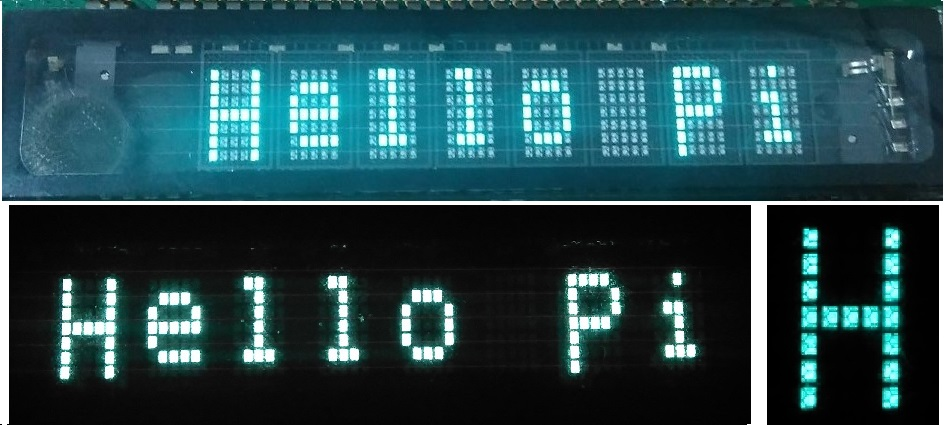

# Raspberry Pi SPI controlled VFD Display
`rpi-spi-vfd` is a simple and basic driver for Futaba C2CIG type VFD display for Raspberry Pi.  
- Supports 1x8 dot matrix VFD with build in character controller (8-MD-06INKM).  
- Prints string and single characters to VFD screen.  
- Based on [bcm2835 library](http://www.airspayce.com/mikem/bcm2835/).  

### Usage
`#include "rpi-spi-vfd.h"` in your code.  
Call `vfd_put_str()` and `vfd_put_char()`.  
See example `test-spi-vfd.c`.  
View of display given in image.

### References
- [spincl tool](https://github.com/CrosseyeJack/spincl)  
- [bcm2835 library spi example](http://www.airspayce.com/mikem/bcm2835/spi_8c-example.html)  
- [Futaba VFDs](https://www.futaba.co.jp/en/display/vfd/lineup.html)  

### License
Distributed under the terms of the MIT license.  
Copyright (c) 2019 [positronics.engineer](https://github.com/positronicsengineer/) at yandex dot com.  